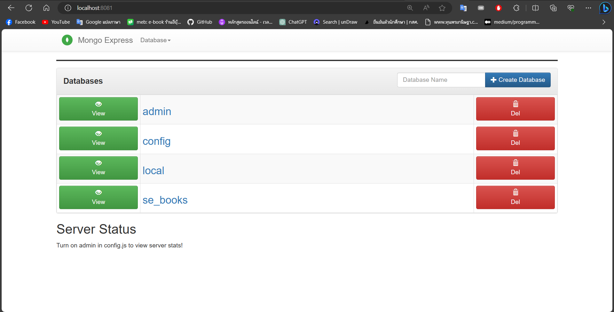
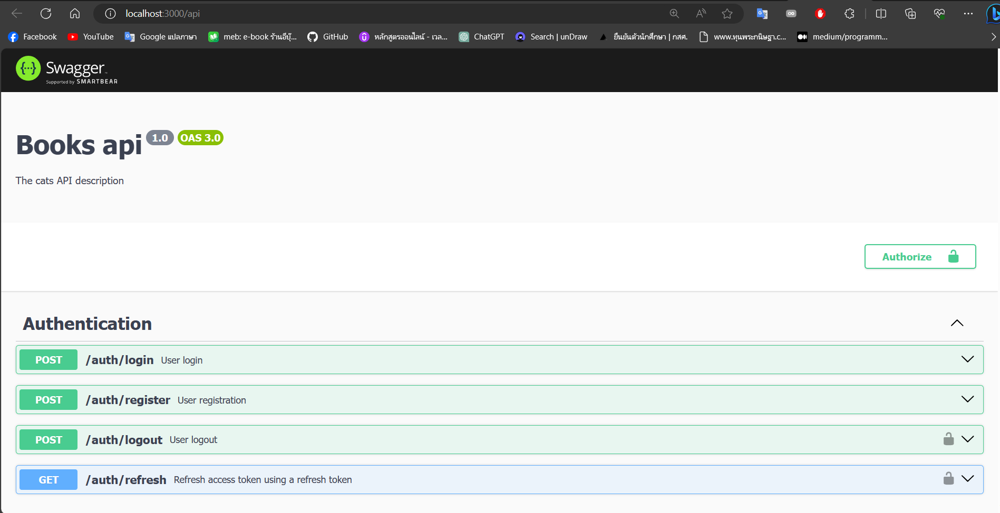

# Book Project

This is a NestJS project for managing and cataloging books.

## Getting Started

To run this project, follow these steps:

### Prerequisites

Before you begin, ensure you have Node.js and npm (Node Package Manager) installed on your system.

- Node.js: [Download and Install Node.js](https://nodejs.org/)
- npm: Typically installed with Node.js

Docker Compose installed on your system.

- Docker: [Download and Install Docker](https://www.docker.com/get-started)
- Docker Compose: [Install Docker Compose](https://docs.docker.com/compose/install/)


### Installing NestJS CLI

1. Open your terminal or command prompt.

2. Install the NestJS CLI globally by running the following command:

   ```sh
   > npm install -g @nestjs/cli
   ```
### Clone Project from GitHub
  ```sh
    > git clone https://github.com/sekkarin/WS--mini-project-book-backend.git
  ```
### Install project
  ```sh
    # change directory
    > cd WS--mini-project-book-backend

    # install package
    > npm install

    # open vs code
    > code .
  ```
### Running the app
  ```bash
  # development
  > npm run start

  # watch mode
  > npm run start:dev

  # production mode
  > npm run start:prod
  ```
### Setting Up Environment Variables

1. Create a file named `.env` in the root directory of your project.

2. Add the following environment variables to your `.env` file:

   ```env
   DATABASE_URL=mongodb://localhost:27018/<db>
   PORT=3000
   SECRET_TOKEN=<string>
   EXPIRES_IN_REFRESH_TOKEN=6d
   EXPIRES_IN_ACCESS_TOKEN=1m
### Setting Up MongoDB with Docker
  ```sh
  # Build and run the application using Docker Compose
  > docker-compose up -d

  # Stopping the Docker Containers
  > docker-compose down
  ```

### Accessing MongoDB Express
  MongoDB Express is a web-based database management tool that allows you to interact with your MongoDB databases. To access MongoDB Express:

  1. Open a web browser and go to http://localhost:8081/.
  You will be able to log in to MongoDB Express and manage your MongoDB databases through the web interface.

  

### Swagger Documentation
  You can access Swagger documentation to explore and test the API endpoints:
  Open a web browser.

  1. Go to http://localhost:3000/api.

  2. This will open the Swagger documentation, where you can view and interact with your API endpoints.

  

